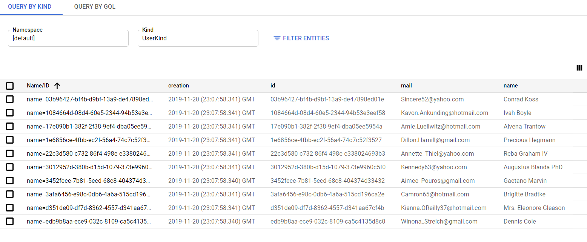

# Inversify - Google Cloud Datastore - Example

## Use examples

First of all run `npm install`

You can start a example by using `nodemon`
 
```sh
npm install -g nodemon
npm start
```

This will start up the server and you can use the example.



